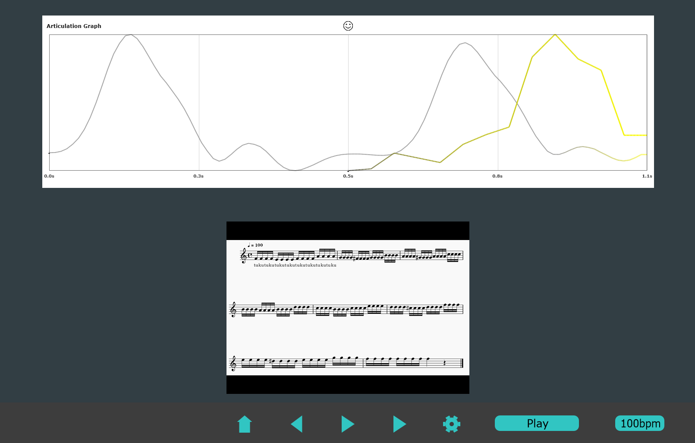

# Articulation Beacon

**Real-time C++/JUCE music education app for measuring trumpet articulation speed, timbre, and shape with graphical feedback.**



Music students get tons of subjective feedback on articulation ("softer", "more staccato!"). **Articulation Beacon** quantifies that feedback in real time and turns it into **visuals** for beginner musicians:
- **Onset accuracy** (how close you start to the beat/target)
- **Timbre accuracy** (how appropriate your timbre is)
- **Shape accuracy** (overal amplitude shape)
---

## Features
- **Live capture & analysis**
  - Low-latency audio I/O via JUCE’s `AudioDeviceManager`
  - Real-time **spectral flux**, **amplitude envelope**, **spectral centroid**

- **Target vs. User comparison**
  - Load a **target articulation window** (reference profile, custom recorded)
  - Overlay **user** vs **target** windows for onset/sustain alignment

- **Metronome engine** with tempo maps; **syncs to video playback**
  - Click subdivisions & count-ins
---

## How it works (high level)

1. **Input**: Audio is read from the selected input device into a lock-free FIFO.  
2. **FFT**: Audio is chunked into frames and FFT is applied.  
3. **Metrics**:
   - **Spectral flux** (onset, sustain detection) with smoothing + adaptive thresholding  
   - **Amplitude envelope** for shape correlation 
   - **Spectral centroid** for timbre tracking  
4. **Visualization**: `Graph` paints visual representation of articulation
---

## Getting started

### Prerequisites
- **JUCE 7+** installed  
- **Windows**: Visual Studio 2022
- **macOS**: Xcode 15+  

### Build & run

**Option A — Projucer (simple)**
1. Open `ArticulationBeacon.jucer` in **Projucer**.  
2. Enable your exporter (VS2022 or Xcode) → **Save and Open in IDE**.  
3. Build & run the **App** target.  

**Option B — CMake**
```bash
# Example; adjust paths to your JUCE checkout
cmake -S . -B build -DJUCE_DIR=deps/juce
cmake --build build --config Release
./build/ArticulationBeacon
```

## Contact
Feel free to open an issue or [reach out](keigo@u.northwestern.edu)!
